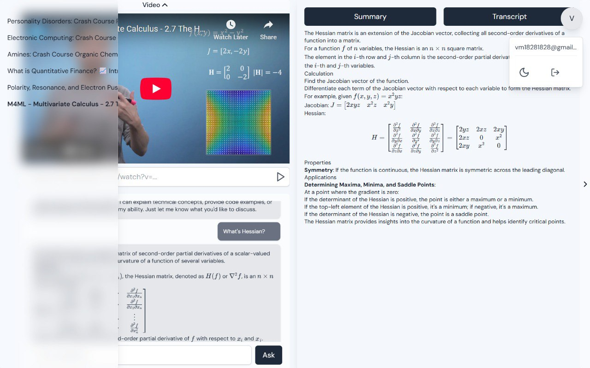
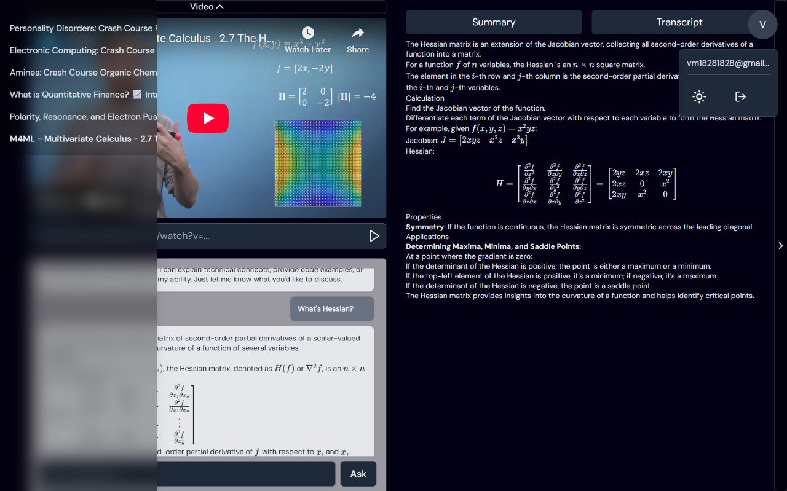
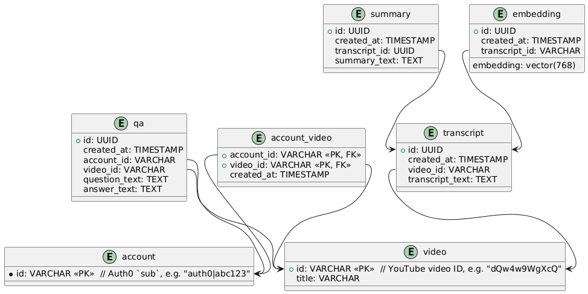

# YT-Assistant

YT-Assistant is a web application designed to help users summarize YouTube video transcripts and extract valuable insights through question answering and reasoning. The app leverages LLMs for NLP tasks, including text summarization and Q&A. It stores video metadata and user data in a PostgreSQL database with the pgvector extension, enabling efficient retrieval for Retrieval-Augmented Generation tasks.

## Roadmap

- [x] User Authentication
- [x] UI Prototype
- [x] Adding User Videos
- [x] Extracting Transcripts
- [x] Video Transcripts Summarization
- [x] Storing Transcripts data for RAG
- [x] Q&A Chat
- [x] Video-specific augmented Q&A
- [ ] Cross-video augmented Q&A
- [ ] Cross-conversation augmented Q&A (user specific)
- [ ] UI Refinement
- [ ] Future Enhancements

## Stack

- **Backend**: FastAPI, Auth0
- **Frontend**: React, TypeScript, Zustand, Tailwind CSS
- **Database**: PostgreSQL + pgvector
- **Task Processing**: Celery + Redis
- **LLM**: Gemini (Google GenAI) + LangChain
- **Code Quality**: ruff, SonarQube
- **CI/CD**: GitHub Actions

### Models

- **Summarization**: _gemini-2.0-flash_
- **Embeddings**: _gemini-embedding-001_

## UI Prototype




## Local Environment

### Dependencies

- Python 3.12
- Poetry 2.1.2
- Node.js v22 + npm v10
- Docker 28.1.1

### Setup

Run the following to install dependencies, build containers and start the project:

```bash
./scripts/init.sh
```

With `--no-build` flag the script will just run the project from local environment

### Environment

Environment variables are stored in `*.env` files in `env/` directory, e.g. `./env/api.env`, `./env/.api.env` etc.

**`.api.env`**

```dotenv
ENV=
API_HOST=
API_PORT=
CLIENT_HOST=
CLIENT_PORT=
GOOGLE_API_KEY=
POSTGRES_URL=postgresql://<username>:<password>@<host>:<port>/<db_name>
AUTH0_DOMAIN=
AUTH0_AUDIENCE=
CORS_ORIGINS=http://localhost:3000,http://prod-frontend.com
REDIS_URL=redis://<username>:<password>@<host>:<port>/<db_index>
```

**`.db.env`**

```dotenv
ENV=
POSTGRES_USER=
POSTGRES_PASSWORD=
POSTGRES_DB=
```

**`.client.env`**

```dotenv
VITE_ENV=
VITE_API_HOST=
VITE_API_PORT=
VITE_CLIENT_HOST=
VITE_CLIENT_PORT=
VITE_AUTH0_DOMAIN=
VITE_AUTH0_AUDIENCE=
VITE_AUTH0_CLIENT_ID=
```

**`.emb.env`**

```dotenv
ENV=
REDIS_URL=redis://user:password@yt_assistant_redis:6379/0
POSTGRES_URL=postgresql://user:password@yt_assistant_db:5432/yt_assistant_db
GOOGLE_API_KEY=
```

## API Documentation

[API Specs](https://vm1828.github.io/yt-assistant/redoc.html)

### Endpoints

- `GET /accounts/` - Returns the authenticated user's account details.
- `POST /accounts/` - Creates a new account for the authenticated user if one does not exist.

- `GET /videos/` - Returns a list of all videos of the authenticated user.
- `GET /videos/{video_id}` - Returns details of a specific video added to the authenticated user's account.
- `POST /videos/` - Adds a YouTube video to the authenticated user's account.

- `GET /transcripts/{video_id}` - Returns the transcript of a specific video for the authenticated user.

- `GET /summaries/{video_id}` - Returns the summary of a video transcript for the authenticated user.
- `POST /summaries/` - Creates a summary of a video transcript for the authenticated user.
- `GET /conversations/{video_id}` - Returns the conversation associated with a specific video for the authenticated user.
- `POST /conversations/` - Creates a new chat conversation linked to a specific video for the authenticated user.
- `POST /messages/` - Sends a new chat message within a specific conversation and returns the LLM-generated response.

\*All endpoints are Auth0 protected

## DB Schema



### account

Stores user id from Auth0.

| Column Name | Type    | Description             |
| ----------- | ------- | ----------------------- |
| id          | VARCHAR | Auth0 ID (sub from JWT) |

## video

Stores metadata about videos and their transcripts.

| Column Name | Type    | Description                    |
| ----------- | ------- | ------------------------------ |
| id          | VARCHAR | Primary key (YouTube video ID) |
| title       | VARCHAR | Video title                    |

## account_video

Tracks the videos that a account has interacted with.

| Column Name | Type      | Description                              |
| ----------- | --------- | ---------------------------------------- |
| account_id  | VARCHAR   | Foreign key to `account` (created by)    |
| video_id    | VARCHAR   | Foreign key to `video`                   |
| created_at  | TIMESTAMP | Timestamp of adding video to the account |

## transcript

Stores the raw transcript text or file paths.

| Column Name     | Type      | Description                      |
| --------------- | --------- | -------------------------------- |
| id              | UUID      | Primary key                      |
| created_at      | TIMESTAMP | Timestamp of transcript creation |
| video_id        | VARCHAR   | Foreign key to `video`           |
| transcript_text | TEXT      | Raw transcript content           |

## summary

Stores the video summary generated by the Hugging Face API.

| Column Name   | Type      | Description                     |
| ------------- | --------- | ------------------------------- |
| id            | UUID      | Primary key                     |
| created_at    | TIMESTAMP | Timestamp of summary generation |
| transcript_id | UUID      | Foreign key to `transcript`     |
| summary_text  | TEXT      | Summary content                 |

## conversation

Stores chat sessions for an account about a specific video.

| Column Name | Type      | Description                                 |
| ----------- | --------- | ------------------------------------------- |
| id          | UUID      | Primary key                                 |
| created_at  | TIMESTAMP | Timestamp of conversation creation          |
| account_id  | VARCHAR   | Foreign key to `account` (owner of session) |
| video_id    | VARCHAR   | Foreign key to `video`                      |

- `UNIQUE (account_id, video_id)` — ensures one conversation per account per video.

## message

Stores individual messages within a conversation.

| Column Name     | Type      | Description                           |
| --------------- | --------- | ------------------------------------- |
| id              | UUID      | Primary key                           |
| created_at      | TIMESTAMP | Timestamp of message creation         |
| conversation_id | UUID      | Foreign key to `conversation`         |
| user_message    | TEXT      | Message content from the account/user |
| ai_response     | TEXT      | Generated response from the AI model  |

## transcript_chunk

Stores chunks of transcripts, vectorized as embeddings in embedding table.

| Column Name   | Type | Description                                             |
| ------------- | ---- | ------------------------------------------------------- |
| id            | UUID | Primary key                                             |
| transcript_id | UUID | Foreign key to `transcript`                             |
| chunk_text    | TEXT | Chunk of transcript text (denormalized for performance) |
| chunk_index   | INT  | Chunk index, can be used for ordering chunks            |

## embedding

Stores vector embeddings related to videos, used for similarity search in RAG tasks.

| Column Name         | Type        | Description                       |
| ------------------- | ----------- | --------------------------------- |
| id                  | UUID        | Primary key                       |
| created_at          | TIMESTAMP   | Timestamp of embedding creation   |
| transcript_chunk_id | UUID        | Foreign key to `transcript_chunk` |
| transcript_emb      | vector(768) | Embedding vector                  |

## Services

### Embedding service

Handles transcript chunk embeddings and vector storage.

**Workflow**:

1. API receives a new video with and processes it, saving transcript to db.
2. API dispatches a task to Celery via Redis.
3. The embedding service splits the transcript into chunks, computes embeddings for each chunk, and stores them in the database (transcript_chunk and embedding tables).

## Unit Testing

To run unit tests for the api and embedding service:

```bash
cd yt_assistant_api
poetry shell
PYTHONPATH=. pytest --cov
coverage report -m
cd ../yt_assistant_emb
PYTHONPATH=. pytest --cov
coverage report -m
exit
```

To run unit tests for the client:

```bash
cd yt_assistant_client
npm run test
npm run coverage # run tests with coverage
```

## Scripts

Utility scripts are in `scripts/` dir.

- `init.sh`
- `alembic_migrate.sh`

## Code Formatting & Linting

```bash
# Check
ruff check
```
