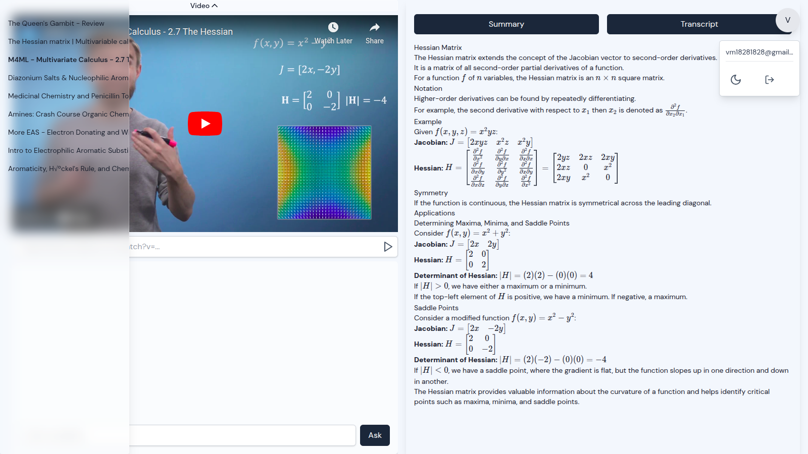
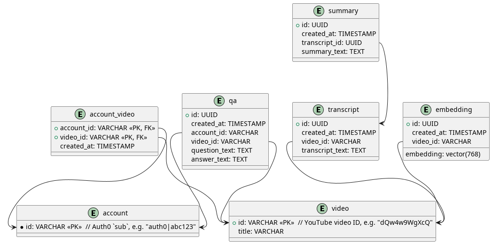

# YT-Assistant

YT-Assistant is a web application designed to help users summarize YouTube video transcripts and extract valuable insights through question answering and reasoning. The app leverages LLMs for NLP tasks, including text summarization and Q&A. It stores video metadata and user data in a PostgreSQL database with the pgvector extension, enabling efficient retrieval for Retrieval-Augmented Generation tasks.

## Roadmap

- [x] User Authentication
- [x] UI Prototype
- [x] Adding User Videos
- [x] Extracting Transcripts
- [x] Video Transcripts Summarization
- [ ] Storing Video Summaries for RAG
- [ ] Q&A Sessions
- [ ] Video Player Integration
- [ ] UI Refinement and Unit Testing
- [ ] Future Enhancements

## Stack

- **Backend**: FastAPI, Auth0
- **Frontend**: React, TypeScript, Zustand, Tailwind CSS
- **Database**: PostgreSQL + pgvector
- **LLM**: Gemini (Google GenAI) + LangChain

# UI Prototype




# Local Environment

## Dependencies

- Python 3.12
- Poetry 2.1.2
- Node.js v22 + npm v10
- Docker 28.1.1

## Setup

Run the following to install dependencies, build containers and start the project:

```bash
./scripts/init.sh
```

With `--no-build` flag the script will just run the project from local environment

## Environment

Environment variables are stored in `*.env` files in `env/` directory, e.g. `./env/api.env`, `./env/.api.env` etc.

**`.api.env`**

```
ENV=
API_HOST=
API_PORT=
CLIENT_HOST=
CLIENT_PORT=
GOOGLE_API_KEY=
POSTGRES_URL=postgresql://<user>:<password>@<host>:<port>/<db_name>
AUTH0_DOMAIN=
AUTH0_AUDIENCE=
CORS_ORIGINS=http://localhost:3000,http://prod-frontend.com
```

**`.db.env`**

```
ENV=
POSTGRES_USER=
POSTGRES_PASSWORD=
POSTGRES_DB=
```

**`.client.env`**

```
VITE_ENV=
VITE_API_HOST=
VITE_API_PORT=
VITE_CLIENT_HOST=
VITE_CLIENT_PORT=
VITE_AUTH0_DOMAIN=
VITE_AUTH0_AUDIENCE=
VITE_AUTH0_CLIENT_ID=
```

# API Documentation

To access API documentation (Swagger UI), navigate to [localhost:8000/docs](localhost:8000/docs)

## Endpoints

- `GET /accounts/` – Returns the authenticated user's account details
- `POST /accounts/` - Creates a new account for the authenticated user if one does not exist.
- `GET /videos/` - Get videos of the authenticated user
- `GET /videos/{video_id}` - Get a video of the authenticated user
- `GET /transcripts/{video_id}` - Get the transcript of the video
- `GET /summaries/{video_id}` – Get the summary of the video

\*All endpoints are Auth0 protected

# DB Schema



## account

Stores user id from Auth0.

| Column Name | Type    | Description             |
| ----------- | ------- | ----------------------- |
| id          | VARCHAR | Auth0 ID (sub from JWT) |

## video

Stores metadata about videos and their transcripts.

| Column Name | Type    | Description                    |
| ----------- | ------- | ------------------------------ |
| id          | VARCHAR | Primary key (YouTube video ID) |
| title       | VARCHAR | Video title                    |

## account_video

Tracks the videos that a account has interacted with.

| Column Name | Type      | Description                              |
| ----------- | --------- | ---------------------------------------- |
| account_id  | VARCHAR   | Foreign key to `account` (created by)    |
| video_id    | VARCHAR   | Foreign key to `video`                   |
| created_at  | TIMESTAMP | Timestamp of adding video to the account |

## transcript

Stores the raw transcript text or file paths.

| Column Name     | Type      | Description                      |
| --------------- | --------- | -------------------------------- |
| id              | UUID      | Primary key                      |
| created_at      | TIMESTAMP | Timestamp of transcript creation |
| video_id        | VARCHAR   | Foreign key to `video`           |
| transcript_text | TEXT      | Raw transcript content           |

## summary

Stores the video summary generated by the Hugging Face API.

| Column Name   | Type      | Description                     |
| ------------- | --------- | ------------------------------- |
| id            | UUID      | Primary key                     |
| created_at    | TIMESTAMP | Timestamp of summary generation |
| transcript_id | UUID      | Foreign key to `transcript`     |
| summary_text  | TEXT      | Summary content                 |

## qa

Stores account questions and generated answers.

| Column Name   | Type      | Description                           |
| ------------- | --------- | ------------------------------------- |
| id            | UUID      | Primary key                           |
| created_at    | TIMESTAMP | Timestamp of Q&A creation             |
| account_id    | VARCHAR   | Foreign key to `account` (created by) |
| video_id      | VARCHAR   | Foreign key to `video`                |
| question_text | TEXT      | Account's question                    |
| answer_text   | TEXT      | Model's answer                        |

## embedding

Stores vector embeddings related to videos, used for similarity search in RAG tasks.

| Column Name | Type        | Description                     |
| ----------- | ----------- | ------------------------------- |
| id          | UUID        | Primary key                     |
| created_at  | TIMESTAMP   | Timestamp of embedding creation |
| video_id    | UUID        | Foreign key to `video`          |
| summary_emb | vector(768) | Embedding vector                |

# Unit Testing

To run unit tests for the api:

```
cd yt_assistant_api
PYTHONPATH=. pytest --cov
coverage report -m

```

To run unit tests for the client:

```
cd yt_assistant_client
npm run test
npm run coverage # run tests with coverage
```

# Scripts

Utility scripts are in `scripts/` dir.

- `init.sh`
- `alembic_migrate.sh`
